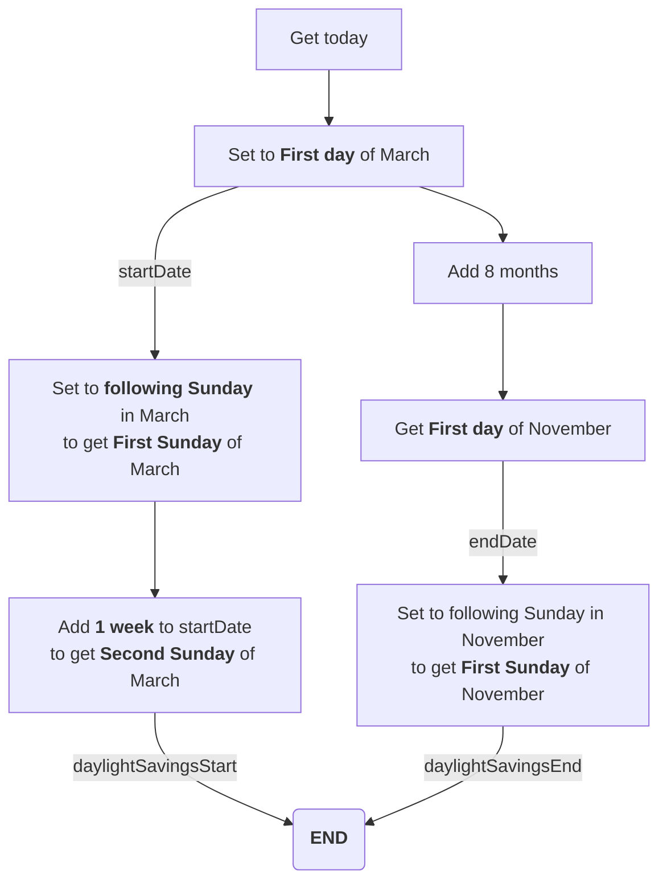

# IdentifyDaylightSavingsSundays

## Problem Statement

To anchor a date to a specific day of the week - to either roll forward, or backward, to a specific day in the week.

### Key Functions

- `nextWeekDay()` - [Zoho Documentation](https://www.zoho.com/deluge/help/functions/number/nextWeekDay.html).
- `previousWeekDay()` - [Zoho Documentation](https://www.zoho.com/deluge/help/functions/number/previousWeekDay.html).
- `addWeek()` - [Zoho Documentation](https://www.zoho.com/deluge/help/functions/datetime/addweek.html).
- `addMonth()` - [Zoho Documentation](https://www.zoho.com/deluge/help/functions/datetime/addmonth.html).
- `addYear()` - [Zoho Documentation](https://www.zoho.com/deluge/help/functions/datetime/addyear.html).

---

## Business Use Case

Given a time and if it falls under the USA daylight savings, to either offset the time by 1 hour, or not.

USA daylight savings is applicable between:

- The second Sunday of March, to
- The first Sunday of November.

---

## Solution

Given the Business Use Case, using the `nextWeekday()` function will be sufficient as we will be performing the following steps:



```jsx
//To produce a date range starting from the 2nd Sunday in March to the 1st Sunday of November in the year.
startDate = (today.getYear().toString() + "-03-01").toDate();
endDate = startDate.addMonth(8);
daylightSavingsStart = startDate.nextWeekDay("Sunday").addWeek(1);
daylightSavingsEnd = endDate.nextWeekDay("Sunday");
```

When you run your `info` statements on `daylightSavingsStart` and `daylightSavingsEnd`, and compare them against `startDate` and `endDate`, you should see the the expected results.

```jsx
info "Start of March: " + startDate + " (" + startDate.toString("E") + ")" + " | " + "Daylight Savings Start: " + daylightSavingsStart + " (" + daylightSavingsStart.toString("E") + ")";
info "Start of November: " + endDate + " (" + endDate.toString("E") + ")" + " | " + "Daylight Savings End: " + daylightSavingsEnd + " (" + daylightSavingsEnd.toString("E") + ")";
```